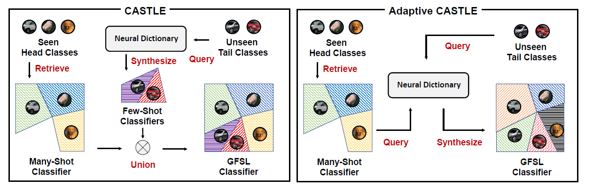

# Learning Adaptive Classifiers Synthesis for Generalized Few-Shot Learning
The code repository for ["Learning Adaptive Classifiers Synthesis for Generalized Few-Shot Learning"](https://arxiv.org/abs/1906.02944) (Accepted by IJCV) in PyTorch. If you use any content of this repo for your work, please cite the following bib entry:

```
@article{YeHZS2021Learning,
      author    = {Han-Jia Ye and
                   Hexiang Hu and
                   De-Chuan Zhan},
      title     = {Learning Adaptive Classifiers Synthesis for Generalized Few-Shot Learning},
      journal   = {International Journal of Computer Vision},
      volume    = {129},
      number    = {6},
      pages     = {1930--1953},
      year      = {2021}
    }
```

## Generalized Few-Shot Learning
Object recognition in the real-world requires handling long-tailed or even open-ended data. An ideal visual system needs to recognize the populated head visual concepts reliably and meanwhile efficiently learn about emerging new tail categories with a few training instances. Class-balanced many-shot learning and few-shot learning tackle one side of this problem, by either learning strong classifiers for head or learning to learn few-shot classifiers for the tail. We investigate the problem of generalized few-shot learning (GFSL) --- a model during the deployment is required to learn about tail categories with few shots and simultaneously classify the head classes.


## Adaptive Classifiers Synthesis
We propose the ClAssifier SynThesis LEarning (Castle), a learning framework that learns how to synthesize calibrated few-shot classifiers in addition to the multi-class classifiers of head classes with a shared neural dictionary, shedding light upon the inductive GFSL. Furthermore, we propose an adaptive version of Castle (ACastle) that adapts the head classifiers conditioned on the incoming tail training examples, yielding a framework that allows effective backward knowledge transfer. As a consequence, ACastle can handle GFSL with classes from heterogeneous domains.



## Generalized Few-shot Learning Results

Experimental results on MiniImageNet with ResNet-12 backbone (Same as [this repo](https://github.com/kjunelee/MetaOptNet)). We report average results with 10,000 randomly sampled few-shot learning episodes for stablized evaluation. Different from the standard few-shot learning, the model is required to discern over the novel classes and all SEEN classes.

**5-Way Harmonic Mean Accuracy (Classification over 64 head and 5 tail categories)**
|  Setups  | 1-Shot 5-Way | 5-Shot 5-Way |   [Link to Weights](https://drive.google.com/drive/folders/1nJvL93R1SJT-GerO0NgGS8dIjgu-t-EE?usp=sharing) |
|:--------:|:------------:|:------------:|:-----------------:|
|     MC   |     0.00    |     0.00    | [1-Shot](https://drive.google.com/file/d/15wBGncIWYIrcw3UrPkw7m3FGqazFbeAW/view?usp=sharing),   [5-Shot](https://drive.google.com/file/d/15wBGncIWYIrcw3UrPkw7m3FGqazFbeAW/view?usp=sharing) |
| ProtoNet |     19.26    |     67.73    | [1-Shot](https://drive.google.com/file/d/1rZEgEAutv-53AVYmCTVuGjZeB_eKpe5I/view?usp=sharing),   [5-Shot](https://drive.google.com/file/d/1kfxt5Tk5epMoqAFGk9SGFgFUWk5OQQ98/view?usp=sharing) |
|   Castle |     66.22    |     76.32    | [1-Shot](https://drive.google.com/file/d/1DhBL6YwNJSAz5thpeBvdejAt2DjIYtms/view?usp=sharing),   [5-Shot](https://drive.google.com/file/d/1FCxVcoxhkpKwb5sQfmzsyacQ_f5a0U_o/view?usp=sharing)|
|   ACastle |   **66.24**  |   **78.33**  | [1-Shot](https://drive.google.com/file/d/1I1zri-DeVlHTzbSIQ63r1rYmLg_ssc--/view?usp=sharing),   [5-Shot](https://drive.google.com/file/d/122gyDQ1SceyBgbDeHiCAENGL4_rb0B5R/view?usp=sharing)|


**20-Way Harmonic Mean Accuracy (Classification over 64 head and 20 tail categories)**
|  Setups  | 1-Shot 20-Way | 5-Shot 20-Way |   [Link to Weights](https://drive.google.com/drive/folders/1nJvL93R1SJT-GerO0NgGS8dIjgu-t-EE?usp=sharing) |
|:--------:|:------------:|:------------:|:-----------------:|
|     MC   |     0.00    |     0.00    | [1-Shot](https://drive.google.com/file/d/15wBGncIWYIrcw3UrPkw7m3FGqazFbeAW/view?usp=sharing),   [5-Shot](https://drive.google.com/file/d/15wBGncIWYIrcw3UrPkw7m3FGqazFbeAW/view?usp=sharing) |
| ProtoNet |     17.71    |     55.51    | [1-Shot](https://drive.google.com/file/d/1rZEgEAutv-53AVYmCTVuGjZeB_eKpe5I/view?usp=sharing),   [5-Shot](https://drive.google.com/file/d/1kfxt5Tk5epMoqAFGk9SGFgFUWk5OQQ98/view?usp=sharing) |
|   Castle |     43.06    |     55.65    | [1-Shot](https://drive.google.com/file/d/1DhBL6YwNJSAz5thpeBvdejAt2DjIYtms/view?usp=sharing),   [5-Shot](https://drive.google.com/file/d/1FCxVcoxhkpKwb5sQfmzsyacQ_f5a0U_o/view?usp=sharing)|
|   ACastle |   **43.63**  |   **56.33**  | [1-Shot](https://drive.google.com/file/d/1I1zri-DeVlHTzbSIQ63r1rYmLg_ssc--/view?usp=sharing),   [5-Shot](https://drive.google.com/file/d/122gyDQ1SceyBgbDeHiCAENGL4_rb0B5R/view?usp=sharing)|

## Standard Few-shot Learning Results

Experimental results on MiniImageNet with ResNet-12 backbone (Same as [this repo](https://github.com/kjunelee/MetaOptNet)). We report average results with 10,000 randomly sampled few-shot learning episodes for stablized evaluation.

**Accuracy on MiniImageNet Dataset**
|  Setups  | 1-Shot 5-Way | 5-Shot 5-Way |  [Link to Weights](https://drive.google.com/drive/folders/1nJvL93R1SJT-GerO0NgGS8dIjgu-t-EE?usp=sharing) |
|:--------:|:------------:|:------------:|:-----------------:|
| ProtoNet |     62.39    |     80.53    | [1-Shot](https://drive.google.com/file/d/1rZEgEAutv-53AVYmCTVuGjZeB_eKpe5I/view?usp=sharing),   [5-Shot](https://drive.google.com/file/d/1kfxt5Tk5epMoqAFGk9SGFgFUWk5OQQ98/view?usp=sharing) |
|   Castle |     66.75    |     81.98    | [1-Shot](https://drive.google.com/file/d/1MYxobRJMnmck_Z7-RZ9TwQTGBgE7Lg9J/view?usp=sharing),   [5-Shot](https://drive.google.com/file/d/102zWS8hGbGqsdDtDmsF1K-JURXu_C1Zz/view?usp=sharing)|
|   ACastle |   **66.83**  |   **82.08**  | [1-Shot](https://drive.google.com/file/d/1Q2WkbU_hDRdqd6T5dmwCapUiT7K2T8vs/view?usp=sharing),   [5-Shot](https://drive.google.com/file/d/1IsOup_LncXFoAAG0nvTcMbUKFP6I-Cfq/view?usp=sharing)|

## Prerequisites

The following packages are required to run the scripts:

- [PyTorch-1.4 and torchvision](https://pytorch.org)

- Package [tensorboardX](https://github.com/lanpa/tensorboardX)

- Dataset: please download the dataset and put images into the folder data/[name of the dataset, miniimagenet or cub]/images

- Pre-trained weights: please download the [pre-trained weights](https://drive.google.com/open?id=14Jn1t9JxH-CxjfWy4JmVpCxkC9cDqqfE) of the encoder if needed. The pre-trained weights can be downloaded in a [zip file](https://drive.google.com/file/d/1XcUZMNTQ-79_2AkNG3E04zh6bDYnPAMY/view?usp=sharing).

## Dataset

### MiniImageNet Dataset

The MiniImageNet dataset is a subset of the ImageNet that includes a total number of 100 classes and 600 examples per class. We follow the [previous setup](https://github.com/twitter/meta-learning-lstm), and use 64 classes as SEEN categories, 16 and 20 as two sets of UNSEEN categories for model validation and evaluation, respectively. The auxiliary images for evaluating SEEN categories could be downloaded from [here](https://drive.google.com/drive/folders/1gk0AsYUrN9NtLIDE9AKaZeVYzftpo6Ol?usp=sharing). 

### TieredImageNet Dataset
[TieredImageNet](https://github.com/renmengye/few-shot-ssl-public) is a large-scale dataset  with more categories, which contains 351, 97, and 160 categoriesfor model training, validation, and evaluation, respectively. The dataset can also be download from [here](https://github.com/kjunelee/MetaOptNet).
We only test TieredImageNet with ResNet backbone in our work. The auxiliary images for evaluating SEEN categories could be downloaded from [here](https://drive.google.com/drive/folders/19SGTIAnTmVohdSNN6Q9G5Qn3bVChOIMr?usp=sharing).

## Code Structures
To reproduce our experiments with FEAT, please use **train_gfsl.py**. **eval_gfsl** can evaluate a GFSL model dierectly. There are four parts in the code.
 - `model`: It contains the main files of the code, including the few-shot learning trainer, evaluator, the dataloader, the network architectures, baselines, and comparison models.
 - `data`: Images and splits for the data sets.
 - `saves`: The pre-trained weights of different networks.
 - `checkpoints`: To save the trained models.

## Arguments
The train_gfsl.py and eval_gfsl.py take similar command line options (details are in the `model/utils.py`):

**Task Related Arguments**
- `dataset`: Option for the dataset (`MiniImageNet`, `TieredImageNet`, or `CUB`), default to `MiniImageNet`

- `way`: The number of classes in a few-shot task during meta-training, default to `5`

- `eval_way`: The number of classes in a few-shot task during meta-test, default to `5`

- `shot`: Number of instances in each class in a few-shot task during meta-training, default to `1`

- `eval_shot`: Number of instances in each class in a few-shot task during meta-test, default to `1`

- `query`: Number of instances in each class to evaluate the performance during meta-training, default to `15`

- `eval_query`: Number of instances in each class to evaluate the performance during meta-test, default to `15`

- `test_mode`: Evaluate the model with `FSL` or `GFSL` during the meta-training, default to `FSL`

**Optimization Related Arguments**
- `sample_class`: The number of classes we sample in each episode which act as pseudo UNSEEN classes, default to `8`

- `num_tasks`: The number of patitions we resplit from `sample_class` in each episode, default to `256`. It means we resample 256 5-way tasks based on the extracted features of the previous 8 classes, which constructs 256 GFSL tasks in each episode efficiently.

- `batch_size`: The batch-size when sampling the instances during meta-training, default to `128`

- `max_epoch`: The maximum number of training epochs, default to `200`

- `episodes_per_epoch`: The number of tasks sampled in each epoch, default to `100`

- `num_eval_episodes`: The number of tasks sampled from the meta-val set to evaluate the performance of the model (note that we fix sampling 10,000 tasks from the meta-test set during final evaluation), default to `200`

- `lr`: Learning rate for the model, default to `0.0001` with pre-trained weights

- `lr_mul`: This is specially designed for set-to-set functions like FEAT. The learning rate for the top layer will be multiplied by this value (usually with faster learning rate). Default to `10`

- `lr_scheduler`: The scheduler to set the learning rate (`step`, `multistep`, or `cosine`), default to `step`

- `step_size`: The step scheduler to decrease the learning rate. Set it to a single value if choose the `step` scheduler and provide multiple values when choosing the `multistep` scheduler. Default to `20`

- `gamma`: Learning rate ratio for `step` or `multistep` scheduler, default to `0.2`

- `augment`: Whether to do data augmentation or not during meta-training, default to `False`

- `mom`: The momentum value for the SGD optimizer, default to `0.9`

- `weight_decay`: The weight_decay value for SGD optimizer, default to `0.0005`

**Model Related Arguments**
- `model_class`: The model to use during meta-learning. We provide our Castle variants (`Castle` and `ACastle`). Default to `Castle`. We also provide the choice for `CLS` and `ProtoNet` when evaluating the model. 

- `backbone_class`: Types of the encoder, i.e., the convolution network (`ConvNet`), ResNet-12 (`Res12`), or Wide ResNet (`WRN`), default to `ConvNet`

- `head`: The number of head of the neural dictionary module, default to `1`

- `dp_rate`: The dropout rate of the neural dictionary module, default to `0.1`

- `temperature`: Temperature over the logits, we #divide# logits with this value. It is useful when meta-learning with pre-trained weights. Default to `1`

**Model Evaluation Criteria**
- `criteria`: We implement **various criteria to evaluate GFSL** performance during model evaluation, i.e., mean accuracy (`Acc`), harmonic mean accuracy (`HMeanAcc`), harmonic mean MAP (`HMeanMAP`), Delta Value (`Delta`), and Area Under the Seen-Unseen Curve (`AUSUC`). Please provide a list of criteria to measure during the evaluation. Default to `Acc, HMeanAcc, HMeanMAP, Delta, AUSUC`. Note that there may exist warnings when evaluate HMeanMAP, please change `recall = tps / tps[-1]` in sklearn/metrics/ranking.py to `recall = np.ones(tps.size) if tps[-1] == 0 else tps / tps[-1]` in that case

**Other Arguments** 
- `orig_imsize`: Whether to resize the images before loading the data into the memory. `-1` means we do not resize the images and do not read all images into the memory. Default to `-1`

- `multi_gpu`: Whether to use multiple gpus during meta-training, default to `False`

- `gpu`: The index of GPU to use. Please provide multiple indexes if choose `multi_gpu`. Default to `0`

- `log_interval`: How often to log the meta-training information, default to every `50` tasks

- `eval_interval`: How often to validate the model over the meta-val set, default to every `1` epoch

- `save_dir`: The path to save the learned models, default to `./checkpoints`

Running the command without arguments will train the models with the default hyper-parameter values. Loss changes will be recorded as a tensorboard file.

## Training and evaluation scripts for ACastle

To train the 1-shot/5-shot 5-way ACastle model with ResNet-12 backbone on MiniImageNet:

    $ python train_gfsl.py  --max_epoch 50 --batch_size 128 --model_class ACastle  --backbone_class Res12 --dataset MiniImageNet --way 5 --eval_way 5 --shot 1 --eval_shot 1 --query 15 --eval_query 15 --temperature 1 --lr 0.0002 --lr_mul 1 --lr_scheduler step --step_size 10 --gamma 0.1 --gpu 0 --init_weights ./saves/initialization/miniimagenet/Res12-pre.pth  --dp_rate 0.5 --test_mode GFSL --num_tasks 256 --sample_class 16
    $ python train_gfsl.py  --max_epoch 50 --batch_size 128 --model_class ACastle  --backbone_class Res12 --dataset MiniImageNet --way 5 --eval_way 5 --shot 5 --eval_shot 5 --query 15 --eval_query 15 --temperature 1 --lr 0.0002 --lr_mul 10 --lr_scheduler step --step_size 10 --gamma 0.5 --gpu 0 --init_weights ./saves/initialization/miniimagenet/Res12-pre.pth  --dp_rate 0.5 --test_mode GFSL --num_tasks 256 --sample_class 16

to evaluate the GFSL performance of the 1-shot/5-shot 20-way models with ResNet-12 backbone on MiniImageNet (change `eval_way` to `5` when evaluating the 5-way GFSL performance):

    $ python eval_gfsl.py --dataset MiniImageNet --eval_way 20 --eval_shot 1 --model_path './saves/initialization/miniimagenet/Res12-pre.pth'  --model_class CLS --gpu 0 --num_workers 4 --num_eval_episodes 10000
    $ python eval_gfsl.py --dataset MiniImageNet --eval_way 20 --eval_shot 1 --model_path './saves/learned/miniimagenet/protonet-1-shot.pth' --model_class ProtoNet --gpu 0 --num_workers 4 --num_eval_episodes 10000
    $ python eval_gfsl.py --dataset MiniImageNet --eval_way 20 --eval_shot 1 --model_path './saves/learned/miniimagenet/castle-1-shot-GFSL.pth' --model_class Castle --gpu 0 --num_workers 4 --num_eval_episodes 10000
    $ python eval_gfsl.py --dataset MiniImageNet --eval_way 20 --eval_shot 1 --model_path './saves/learned/miniimagenet/acastle-1-shot-GFSL.pth' --model_class ACastle --gpu 0 --num_workers 4 --num_eval_episodes 10000

## Acknowledgment
We thank following repos providing helpful components/functions in our work.
- [FEAT](https://github.com/Sha-Lab/FEAT)
